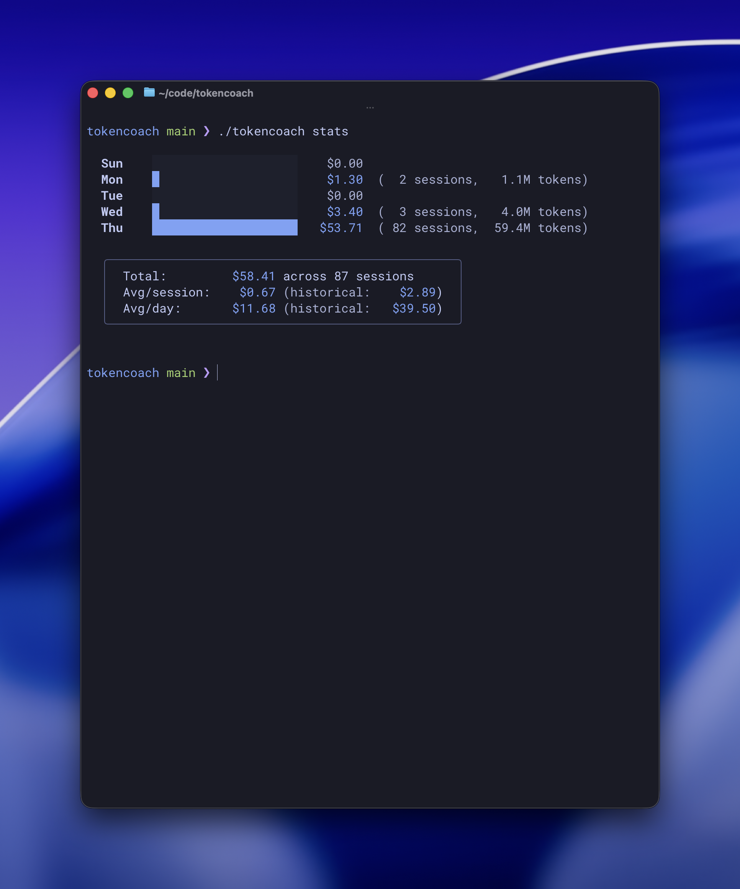
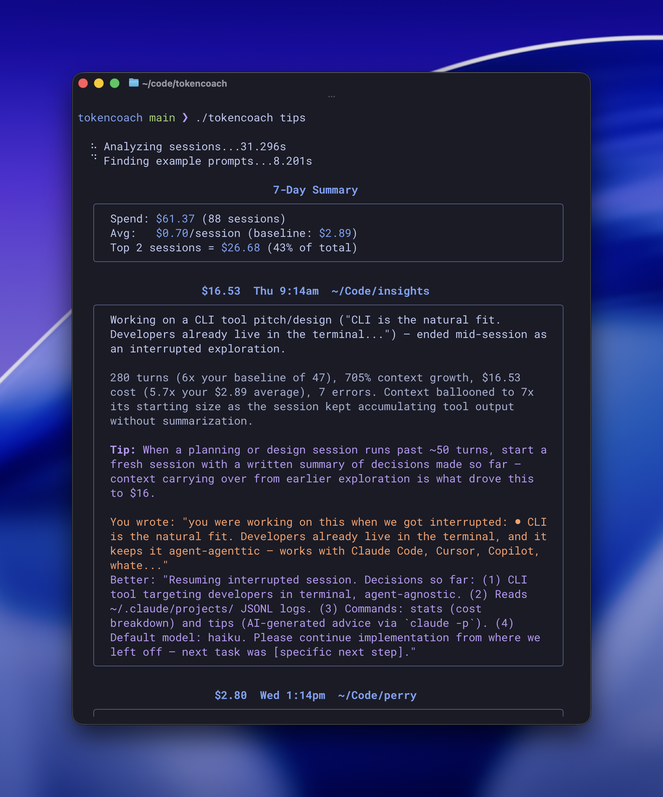

# tokencoach

Cost analytics and AI-powered coaching for your Claude Code sessions.

tokencoach reads your local Claude Code session data (`~/.claude/projects/`) and gives you visibility into how much you're spending, broken down by day, session, and model.

## Install

```
brew install zhubert/tap/tokencoach
```

Or build from source:

```
go build -o tokencoach .
```

## Commands

### `tokencoach stats`

Daily cost breakdown with historical comparison. Shows a bar chart of spending per day with session counts, token usage, and averages compared to your historical baseline.



Use `--days N` to look back further than the current week:

```
tokencoach stats --days 30
```

### `tokencoach tips`

AI-generated tips to reduce your costs. Analyzes your most expensive recent sessions and identifies patterns like retry loops, excessive exploration, or interrupted workflows.



Flags:
- `--days N` — number of days to analyze (default: 7)
- `--top N` — number of top sessions to analyze (default: 10)
- `--model MODEL` — model for analysis: haiku, sonnet, opus (default: sonnet)

Requires the [Claude CLI](https://docs.anthropic.com/en/docs/claude-code) to be installed.

## How It Works

tokencoach parses the JSONL session logs that Claude Code writes to `~/.claude/projects/`. For each session it extracts token usage (input, output, cache read, cache creation), tool usage, errors, interruptions, and context growth. Costs are computed using per-model pricing for the Opus, Sonnet, and Haiku model families.

## License

MIT
